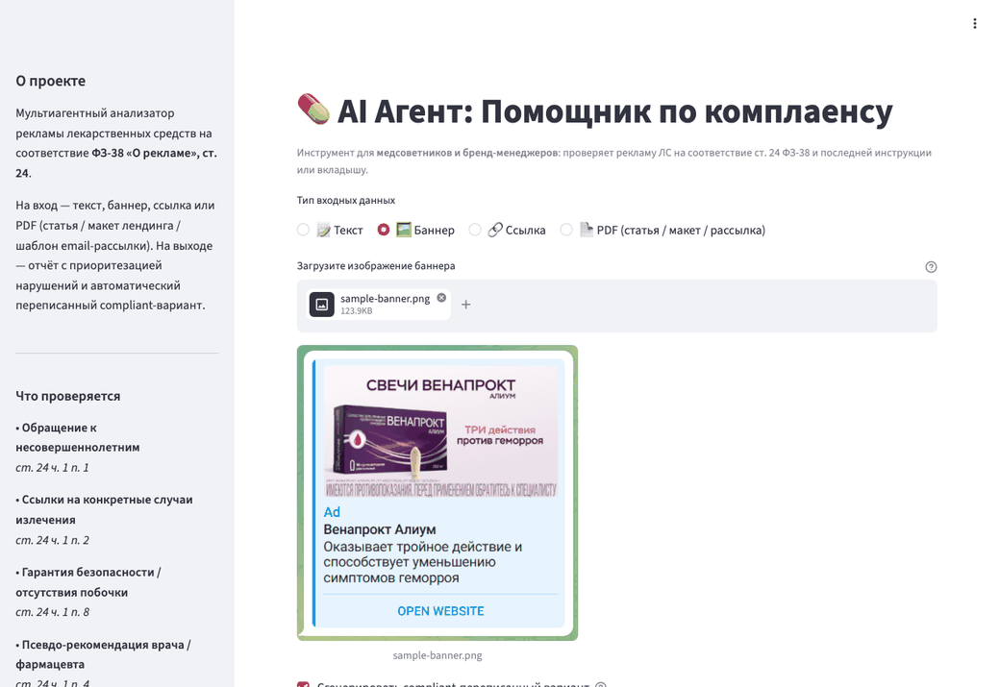
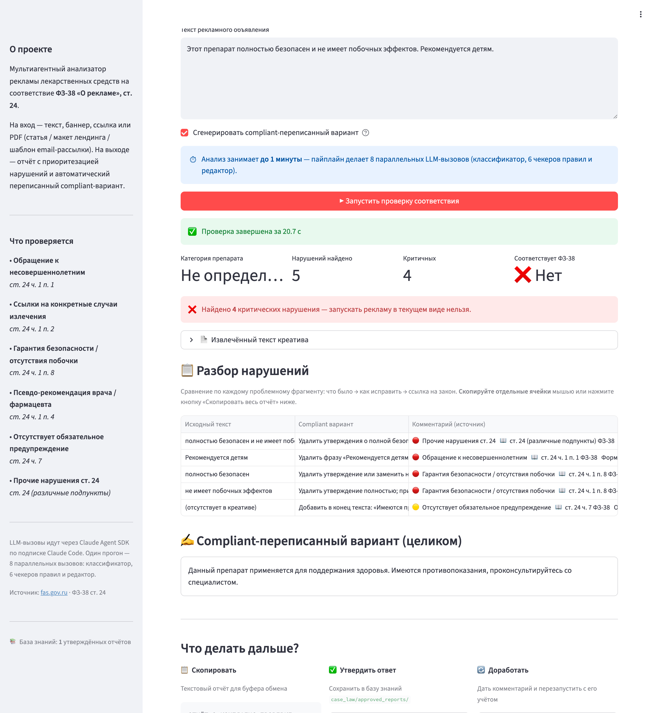
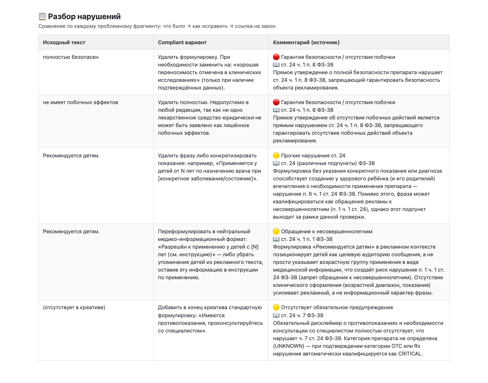

<div align="center">

# 💊 pharma-ad-compliance-agent

### Мульти-агентная проверка рекламы лекарств на соответствие ст. 24 ФЗ-38 — за секунды, а не за дни

**📝 Текст · 🖼 Баннер · 🔗 Ссылка · 📄 PDF → ⚖️ отчёт о нарушениях + ✍️ переписанный compliant-вариант**

[](https://github.com/alexeygoltsevv/pharma-ad-compliance-agent/actions/workflows/ci.yml)

[](https://github.com/astral-sh/ruff)




<sub>Загрузка баннера → Vision-OCR → отчёт по ст. 24 ФЗ-38. В примере — OTC-баннер с дисклеймером: критичных нарушений нет.</sub>

</div>

На вход — **текст, баннер (изображение), ссылка на лендинг или PDF** (статья /
макет лендинга / email-рассылка). На выходе — структурированный отчёт о нарушениях
**ФЗ-38 «О рекламе», ст. 24** и автоматически переписанный compliant-вариант.

> **Статус:** рабочий пайплайн по всем типам ввода (текст / URL / изображение / PDF).
> Vision-OCR доставляет картинку в модель честным content-блоком; пайплайн ускорен
> (~4.5×), защищён от типовых атак на ввод и покрыт тестами + CI.

## 🎯 Зачем

Рекламу ЛС в России контролирует ФАС по ст. 24 ФЗ-38. Любой новый креатив —
даже небольшой баннер или письмо в рассылке — нужно согласовывать с медицинскими
советниками и юристами, и это согласование обычно занимает 2–3 дня, а иногда и до
недели.

Этот агент воспроизводит самые частые проверки за секунды и подсвечивает
критичные нарушения ещё до отправки на согласование. Менеджеры, медицинские
советники, медиабайеры и дизайнеры могут проверить креатив сами — это сокращает
цикл согласования в 3–4 раза.

## 🏗 Архитектура

```
Creative (текст | изображение | url | pdf)
    │
    ▼
parser_agent ───► drug_classifier (Rx / OTC / БАД)   ← Haiku
    │
    ├──► art24_p1_minors               ┐
    ├──► art24_p2_specific_cases       │ 6 чекеров параллельно
    ├──► art24_p3_no_side_effects      │ (asyncio.gather, Sonnet)
    ├──► art24_p4_doctor_recommendation│
    ├──► art24_p5_mandatory_disclaimer │
    └──► art24_other                   ┘
    │
    ▼
aggregator (дедуп + кросс-правило + приоритет: CRITICAL / WARNING / RECOMMENDATION)
    │
    ▼
editor (переписывает в compliant-вид)                ← Haiku
    │
    ▼
ComplianceReport (Pydantic) → JSON / Markdown / Streamlit
```

- **Парсер**: текст — напрямую; URL — fetch + извлечение текста; изображение/PDF —
  Claude Vision OCR (страницы PDF распознаются параллельно, в порядке документа).
- **Чекеры** — по одному модулю на подпункт ст. 24, регистрируются в `ALL_CHECKERS`.
- **Аггрегатор** — чистый Python: дедуп по `(rule_id, цитата)` + кросс-правило
  (catch-all `ART24_OTHER` не дублирует находки специализированных чекеров).
- **Модели**: чекеры — Sonnet (юридическая оценка), классификатор и редактор —
  Haiku; extended thinking отключён по умолчанию (быстрее, без потери качества на
  этих задачах).

Все LLM-вызовы идут через **[Claude Agent SDK](https://github.com/anthropics/claude-agent-sdk-python)**
с авторизацией по локальному `claude` CLI (подписка Claude Code). `ANTHROPIC_API_KEY`
для локальной разработки **не требуется**.

## 🚀 Быстрый старт

```bash
make install        # создаёт .venv и ставит зависимости
make install-locked # воспроизводимая установка из requirements.lock
make demo           # прогон примера неконформного креатива через пайплайн
make streamlit      # демо-UI на localhost:8501
```

### CLI

```bash
compliance check --text "Этот препарат полностью безопасен и не имеет побочных эффектов."
compliance check --image docs/sample-banner.png   # пример баннера из репозитория
compliance check --url https://example.com/landing
compliance check --pdf creative.pdf
```

## ⚡ Производительность

Пайплайн делает ~8 LLM-вызовов (классификатор + 6 чекеров + редактор). Ключевые
оптимизации: extended thinking off, единая волна чекеров (семафор 6),
Haiku для классификатора/редактора.

| Сценарий (текст) | Было | Стало |
|---|---|---|
| без переписывания | ~65 c | **~14 c** |
| полный (с rewrite) | ~90 c+ | **~25 c** |

Тюнинг через env: `PHARMA_AD_MODEL`, `PHARMA_AD_MAX_CONCURRENCY`,
`PHARMA_AD_THINKING`, `PHARMA_AD_LLM_TIMEOUT`, `PHARMA_AD_TIMING`.

## 🛡 Безопасность

Пользовательский ввод считается недоверенным:

- **SSRF-защита** — `--url` принимает только http(s), резолвящиеся в публичные IP;
  приватные/loopback/link-local/метадата-адреса отклоняются, каждый редирект
  перепроверяется (обход для локальных тестов: `PHARMA_AD_ALLOW_PRIVATE_URLS=1`).
- **Лимиты ресурсов** — размер файла, число страниц PDF и Vision-вызовов, размер
  ответа URL ограничены (env: `PHARMA_AD_MAX_FILE_BYTES`, `PHARMA_AD_PDF_MAX_PAGES`,
  `PHARMA_AD_PDF_MAX_OCR_PAGES`, `PHARMA_AD_URL_MAX_BYTES`).
- **Защита от prompt injection** — во всех системных промптах текст креатива
  трактуется как *данные, а не инструкции*.
- **Изоляция агентов** — каждый вызов: `allowed_tools=[]` (чистый text-in/text-out,
  без доступа к ФС/сети), таймаут на вызов, ретраи транзиентных ошибок CLI.

## 🔍 Пример: было / стало

**Вход:**

> Этот препарат полностью безопасен и не имеет побочных эффектов. Рекомендуется детям.

**Выход (фрагмент):**

```json
{
  "drug_class": "OTC",
  "violations": [
    {
      "rule_id": "ART24_P3_NO_SIDE_EFFECTS",
      "severity": "CRITICAL",
      "quote": "полностью безопасен и не имеет побочных эффектов",
      "explanation": "Гарантия безопасности и отсутствия побочных действий запрещена ст. 24 ч. 1 п. 8 ФЗ-38.",
      "suggested_fix": "Удалить утверждение, добавить дисклеймер о противопоказаниях."
    },
    {
      "rule_id": "ART24_P1_MINORS",
      "severity": "CRITICAL",
      "quote": "Рекомендуется детям",
      "explanation": "Обращение к несовершеннолетним в рекламе ЛС запрещено (ст. 24 ч. 1 п. 1)."
    },
    {
      "rule_id": "ART24_P5_MANDATORY_DISCLAIMER",
      "severity": "WARNING",
      "explanation": "Отсутствует обязательное предупреждение «Имеются противопоказания, проконсультируйтесь со специалистом» (ст. 24 ч. 7)."
    }
  ],
  "rewritten_text": "Препарат показан при ... Имеются противопоказания, проконсультируйтесь со специалистом."
}
```

Тот же разбор в интерфейсе (неконформный текст — 3 критических нарушения):

<div align="center"></div>

### Разбор нарушений — табличная вёрстка

Каждое нарушение даётся одной строкой: исходный фрагмент → compliant-вариант → ссылка на закон. Строки растут под контент (`vertical-align: top`, перенос по словам), ничего не обрезается:

<div align="center"></div>

Полная HTML-версия для предпросмотра: [docs/violations-table.html](docs/violations-table.html).

> Примечание по неймингу: суффикс `Pn` в `rule_id` — внутренняя метка чекера, а не
> номер пункта закона (например, `ART24_P3_NO_SIDE_EFFECTS` соответствует ч. 1 п. 8).

## ✅ Качество и CI

```bash
make lint        # ruff
make typecheck   # mypy (без ошибок)
make test        # pytest -m "not llm" — юнит-тесты без LLM
make eval        # регрессия по case_law/regression_dataset/ (нужна подписка)
```

CI (GitHub Actions) гоняет **ruff + mypy + pytest (не-LLM)**. Регрессионный eval
проверяет recall (все ожидаемые нарушения найдены) и precision («чистые» креативы
не должны давать ложных срабатываний); он запускается локально, т.к. у раннера нет
подписки Claude.

## 📁 Структура репозитория

```
src/pharma_ad_compliance/
  agents/
    parser_agent.py          # ввод → текст (+ Vision OCR, SSRF-гард, лимиты)
    drug_classifier_agent.py # Rx / OTC / БАД (Haiku)
    rule_checkers/           # 6 параллельных чекеров по подпунктам ст. 24
    aggregator_agent.py      # дедуп + приоритизация (Python)
    editor_agent.py          # переписывание в compliant-вид (Haiku)
    _llm.py                  # единая точка LLM-вызовов (семафор, таймаут, ретраи, vision)
  schemas/                   # Pydantic v2: Creative, Violation, ComplianceReport
  rag/                       # загрузчик текста ст. 24 ФЗ-38
  prompts/                   # версионируемые системные промпты (Markdown)
  cli.py                     # typer CLI
  app.py                     # Streamlit-демо
case_law/
  fas_decisions/             # публичные решения ФАС по ст. 24
  regression_dataset/        # вход + ожидаемые нарушения для eval
.claude/skills/              # karpathy-guidelines (рабочие правила для разработки)
tests/                       # юнит-тесты (без LLM)
requirements.lock            # запиненные зависимости для воспроизводимой сборки
```

## 📚 Источники

- [ФЗ-38 «О рекламе» статья 24](http://www.consultant.ru/document/cons_doc_LAW_58968/) — текст закона.
- [Решения ФАС по рекламе ЛС](https://fas.gov.ru/) — публичная база, основа `case_law/`.

## 📄 Лицензия

MIT — см. [LICENSE](LICENSE).
